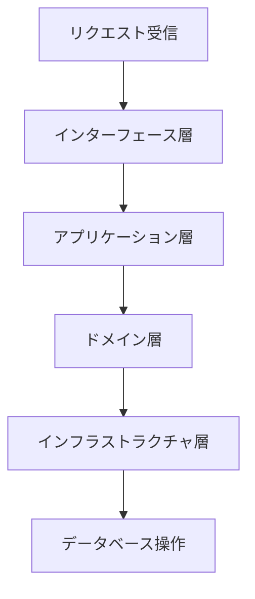

# Python Template for Domain-Driven Development

## 概要

このリポジトリは、ドメイン駆動設計 (DDD) を採用したPythonプロジェクトのテンプレートです。  
複雑なビジネスロジックを整理し、保守性の高いコードベースを構築するための基盤を提供します。

## 使用方法

### Dev Containerの立ち上げ

1. **VSCodeのセットアップ**  
   - 必要な拡張機能をインストールします（例: Remote - Containers）。
2. **Dev Containerの起動**  
   - VSCodeでリポジトリを開き、`Reopen in Container`を選択します。
3. **Poetryのセットアップ**  
   - コンテナ内で以下のコマンドを実行して依存関係をインストールします。  

     ```bash
     poetry install --no-root --no-interaction
     ```

### Pythonの使用方法

- スクリプトの実行例:

  ```bash
  python src/main.py
  ```

- テストの実行例:

  ```bash
  pytest
  ```

## ディレクトリ構成

以下は本プロジェクトのディレクトリ構造です。

```
python-template/
├── src/
│   ├── custom/
│   │   ├── application/
│   │   ├── domein/
│   │   ├── infrastructure/
│   │   └── interfaces/
│   ├── core/
│   │   ├── error/
│   │   ├── session/
│   │   └── support/
│   └── base/
├── test/
│   ├── unit/
│   └── integration/
├── notebook/
├── data/
├── docs/
└── .devcontainer/
```

## インターフェース定義

以下はAPIメソッドのテンプレート例です。

| メソッド名       | HTTPメソッド | エンドポイント       | 説明                     |
|------------------|-------------|---------------------|--------------------------|
| `create_user`    | POST        | `/api/users`        | ユーザーを新規作成する   |
| `get_user`       | GET         | `/api/users/{id}`   | ユーザー情報を取得する   |
| `update_user`    | PUT         | `/api/users/{id}`   | ユーザー情報を更新する   |
| `delete_user`    | DELETE      | `/api/users/{id}`   | ユーザーを削除する       |

## 概略図

以下はプロジェクトのフローチャート例です。



## その他

- **依存関係管理**: Poetryを使用しています。
- **開発環境**: Dockerを使用したDev Containerを推奨します。
- **ライセンス**: 本プロジェクトのライセンスについては`LICENSE`ファイルを参照してください。
